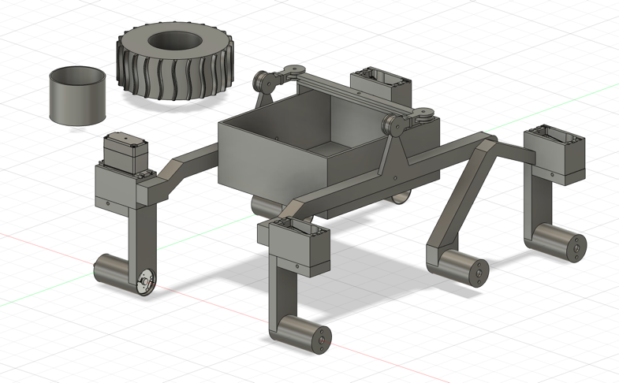
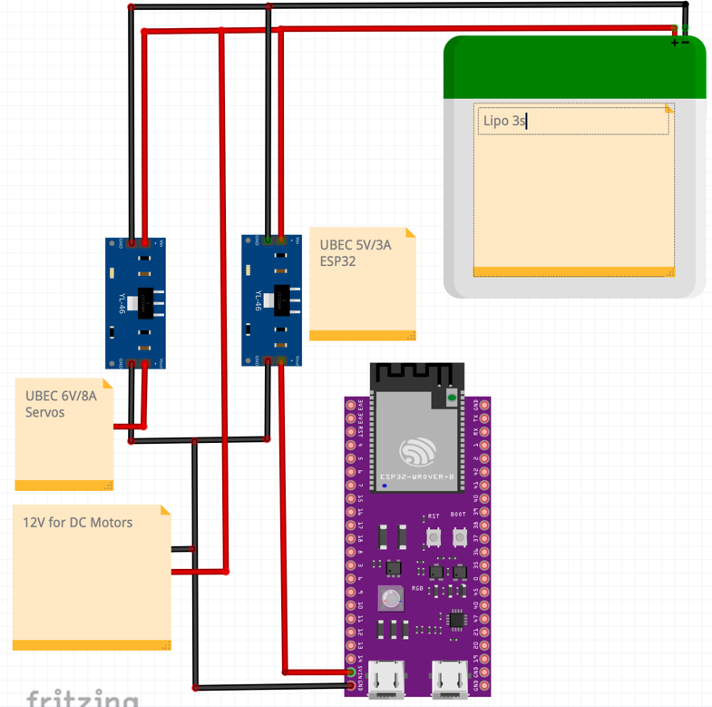
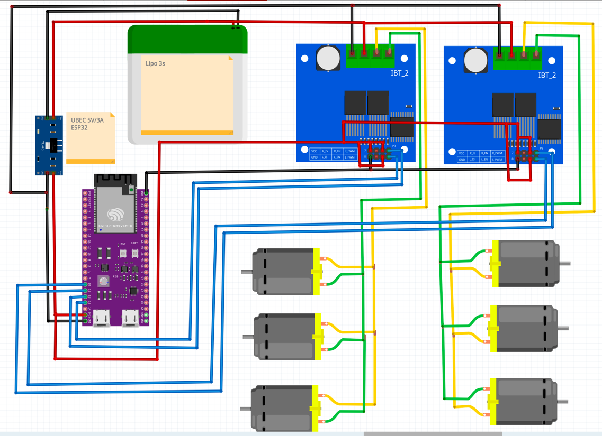
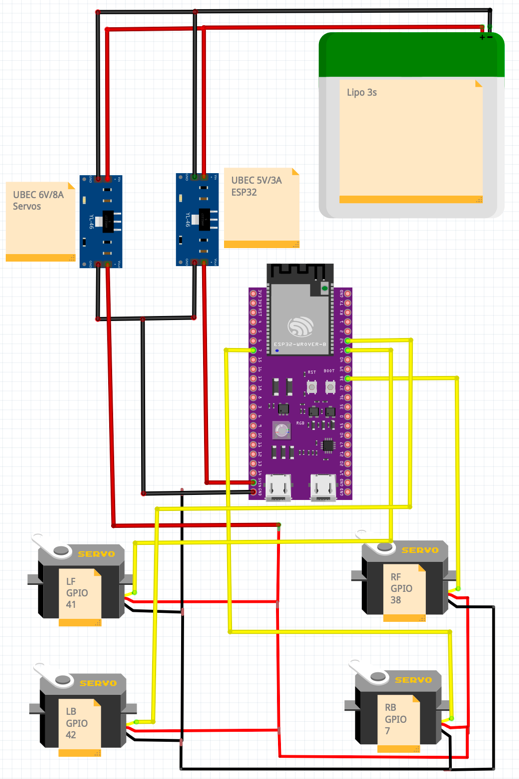

# Papaya Pathfinder

  

Papaya Pathfinder is an open-source family of small remote-controlled rovers based on the **ESP32**.

The project currently includes **two rover variants**, designed for different sizes, motors, and power requirements.

All mechanical parts of the rovers are fully **3D-printable**, and all models are available in the `3d-models/` directories of each rover variant.

The rovers can be operated using either **WiFi** or **ExpressLRS (ELRS)**, depending on the firmware configuration.

## Papaya Pathfinder

- **Controller:** ESP32
- **Radio:** ELRS receiver *(required only when running `firmware-elrs`)*
- **Motor Drivers:** 2× BTS7960 43A (or similar high-current driver)
- **Motors:** 6× GA25 DC gear motors
- **Steering:** 4× MS24 servos
- **Power:** LiPo 3S Battery
- **Voltage Regulation:**
  - 1× UBEC 5V/3A (for ESP32)
  - 1× UBEC 6V/8A (High current supply for Servos)

### Firmware
The rover supports multiple firmware configurations, each enabling a different communication method.

- **[`firmware-wifi`](pathfinder/firmware-wifi/)**
  - WiFi-based control
  - HTTP API for movement commands
  - Compatible controllers:
    - **[Python desktop controller](desktop-controller/)** — sends gamepad-based control commands to the rover via HTTP.
    - **[Android mobile app](android-controller/)** — enables rover control using a gamepad, providing the same driving experience available on the desktop controller.

- **[`firmware-elrs`](pathfinder/firmware-elrs/)**
  - Control via **ExpressLRS (ELRS)**

### 3D-Printed Parts

  

All STL files for this rover are available in: **[`pathfinder/3d-models/`](pathfinder/3d-models/)**

The complete mechanical design is also available in **STEP format**: **[`pathfinder/cad/papaya-pathfinder.step`](pathfinder/cad/papaya-pathfinder.step)**

Use **PETG or PLA** for the structural parts, and **TPU** for the tires. All parts are designed to be assembled using **M3 screws and nuts**.

| File                | Qty | Material | Notes                                                  |
|---------------------|-----|--------|--------------------------------------------------------|
| `body.stl`          | 1   | PETG / PLA | Main chassis                                           |
| `arm_left.stl`      | 1   | PETG / PLA | Left suspension arm                                    |
| `arm_right.stl`     | 1   | PETG / PLA | Right suspension arm                                   |
| `pivot_left.stl`    | 1   | PETG / PLA | Left pivot mount                                       |
| `pivot_right.stl`   | 1   | PETG / PLA | Right pivot mount                                      |
| `differential_bar.stl` | 1   | PETG / PLA | Central rocker-bogie differential bar                  |
| `differential_link_left.stl` | 1   | PETG / PLA | Left link between differential bar and suspension arm  |
| `differential_link_right.stl` | 1   | PETG / PLA | Right link between differential bar and suspension arm |
| `motor_mount.stl`   | 4   | PETG / PLA | Motor mounts for GA25 motors used on steering arms     |
| `horn_adapter.stl`  | 4   | PETG / PLA | Servo horn adapters for steering servos. **Print horizontally for strength.**              |
| `rim.stl` | 6 | PETG / PLA | **Standard option.** Connects directly to the motor shaft (D-shape). Simple, but can strip over time under high torque. |
| `rim_hexagonal.stl` | 6 | PETG / PLA | **Pro option (Recommended).** Requires **12mm brass hex adapters**. Much stronger connection, prevents the motor shaft from stripping the plastic. |
| `tire.stl`   | 6 | TPU | Tires                                                  |

### Wiring Diagram
- Power Distribution: Shows the rover power distribution, including the LiPo 3S battery,
  separate UBECs for logic (5V) and servos (6V), and the motor power rails.

  

- Motors: Motor wiring using two BTS7960 drivers, each controlling one side of the rover.
  The ESP32 provides PWM control signals to each driver.

  

- Servos: Servo wiring powered by a dedicated 6V UBEC. PWM control signals are provided by the ESP32.

  

- System Overview: High-level overview of the complete rover wiring, combining power,
  motor drivers, servos and control logic.

  

---

## Papaya Pathfinder Mini

- **ESP32 with camera (ESP32-CAM / ESP32-S3-CAM)** *(required only when running `firmware-wifi`)*
- **ELRS receiver** *(required only when running `firmware-elrs`)*
- **6× N20 DC gear motors**
- **Power supply: LiPo 2S**

### Firmware
The rover supports multiple firmware configurations, each enabling a different communication method.

- **[`firmware-wifi`](pathfinder-mini/firmware-wifi/)**
  - WiFi-based control
  - HTTP API for movement commands
  - Live video streaming over WiFi
  - Compatible controllers:
    - **[Python desktop controller](desktop-controller/)** — displays the live video stream and sends gamepad-based control commands to the rover via HTTP.
    - **[Android mobile app](android-controller/)** — displays the live video stream and enables rover control using a gamepad, providing the same driving experience available on the desktop controller.

- **[`firmware-elrs`](pathfinder-mini/firmware-elrs/)**
  - Control via **ExpressLRS (ELRS)**

### 3D-Printed Parts

  

All STL files for this rover are available in: **[`pathfinder-mini/3d-models/`](pathfinder-mini/3d-models/)**

The complete mechanical design is also available in **STEP format**: **[`pathfinder-mini/cad/papaya-pathfinder-mini.step`](pathfinder-mini/cad/papaya-pathfinder-mini.step)**

Use **PETG or PLA** for the structural parts, and **TPU** for the tires. All parts are designed to be assembled using **M3 screws and nuts**.

| File                | Qty | Material | Notes                                                      |
|---------------------|-----|------|------------------------------------------------------------|
| `body.stl`          | 1 | PETG / PLA | Main chassis                                               |
| `arm_left.stl`      | 1 | PETG / PLA | Left suspension arm                                        |
| `arm_right.stl`     | 1 | PETG / PLA | Right suspension arm                                       |
| `pivot_left.stl`    | 1 | PETG / PLA | Left pivot mount                                           |
| `pivot_right.stl`   | 1 | PETG / PLA | Right pivot mount                                          |
| `differential_bar.stl`  | 1   | PETG / PLA | Central differential bar for the rocker-bogie suspension   |
| `differential_link.stl` | 2   | PETG / PLA | Links between the differential bar and each suspension arm |
| `motor_retainer.stl` | 6 | PETG / PLA | Holds each N20 motor                                       |
| `rim.stl`       | 6 | PETG / PLA | Wheel rims                                                 |
| `tire.stl`   | 6 | TPU | Tires                                                      |

## License

This project is licensed under the **Apache License 2.0**.  
See the [LICENSE](LICENSE) file for details.