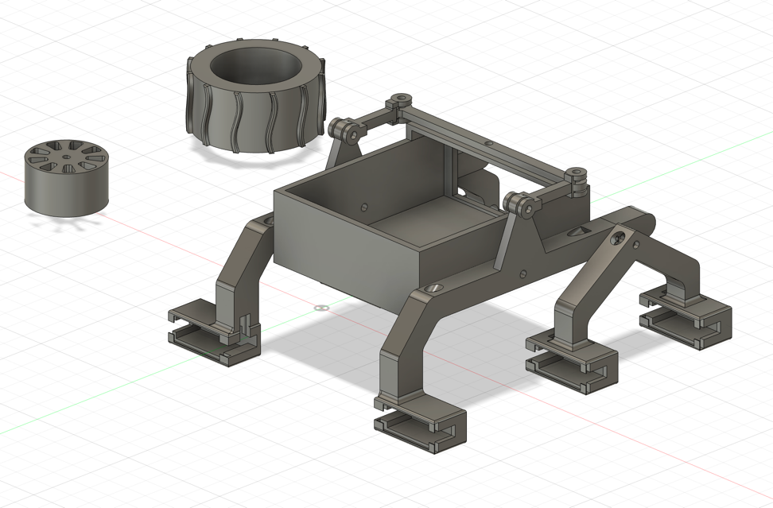

# Papaya Pathfinder

  

Papaya Pathfinder is a small remote-controlled rover based on an ESP32-S3-CAM.  
It streams live video over WiFi and receives movement commands through a simple HTTP API.  
The rover uses a single motor driver capable of controlling six N20 DC gear motors with proportional PWM.

All mechanical parts of the rover are fully 3D-printable, and all models are available in the `3d-models/` directory.

## Hardware Components
- **ESP32-S3-CAM** — handles control logic, WiFi communication, and real-time video streaming.
- **Motor driver** — controls all six motors with independent direction and proportional PWM.
- **Six N20 DC gear motors** — provide the rover’s traction and movement.

## Software Components
- **ESP32-S3-CAM firmware** — implements the rover’s control logic, generates the real-time video stream, and exposes simple HTTP endpoints for movement commands.
- **Python desktop controller** — displays the live video stream and sends gamepad-based control commands to the rover via HTTP.
- **Android mobile app** — displays the live video stream and enables rover control using a gamepad, providing the same driving experience available on the desktop controller.

## 3D-Printed Parts

  

Use **PETG or PLA** for the structural parts, and **TPU** for the tires.

You must choose **one rim size** and print the **matching tires**:
- **32 mm rims → 42 mm tires**
- **35 mm rims → 50 mm tires**

| File                 | Qty | Material | Notes                                            |
|----------------------|-----|----------|--------------------------------------------------|
| `body.stl`           | 1 | PETG / PLA | Main chassis                                     |
| `arm_left.stl`       | 1 | PETG / PLA | Left suspension arm                              |
| `arm_right.stl`      | 1 | PETG / PLA | Right suspension arm                             |
| `pivot_left.stl`     | 1 | PETG / PLA | Left pivot mount                                 |
| `pivot_right.stl`    | 1 | PETG / PLA | Right pivot mount                                |
| `differential_bar.stl`   | 1   | PETG / PLA | Central differential bar for the rocker-bogie suspension   |
| `differential_link.stl`  | 2   | PETG / PLA | Links between the differential bar and each suspension arm |
| `motor_retainer.stl` | 6 | PETG / PLA | Holds each N20 motor                             |
| `rim_32mm.stl`       | 6 | PETG / PLA | Compatible tires: `tire_42mm_v1`, `tire_42mm_v2` |
| `rim_35mm.stl`       | 6 | PETG / PLA | Compatible tires: `tire_50mm_v1`, `tire_50mm_v2` |
| `tire_42mm_v1.stl`   | 6 | **TPU** | For 32 mm rim                                    |
| `tire_42mm_v2.stl`   | 6 | **TPU** | For 32 mm rim                                    |
| `tire_50mm_v1.stl`   | 6 | **TPU** | For 35 mm rim                                    |
| `tire_50mm_v2.stl`   | 6 | **TPU** | For 35 mm rim                                    |

