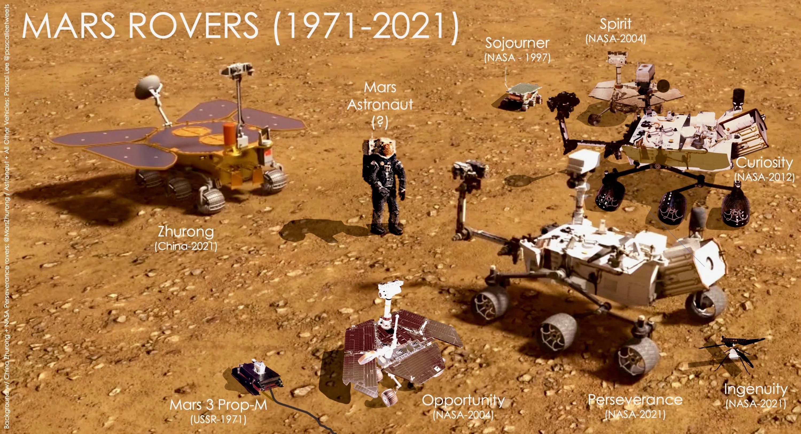
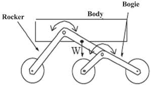
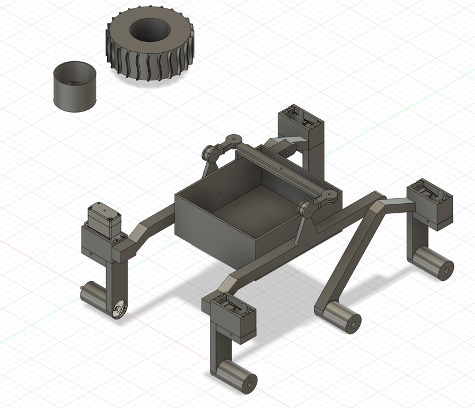
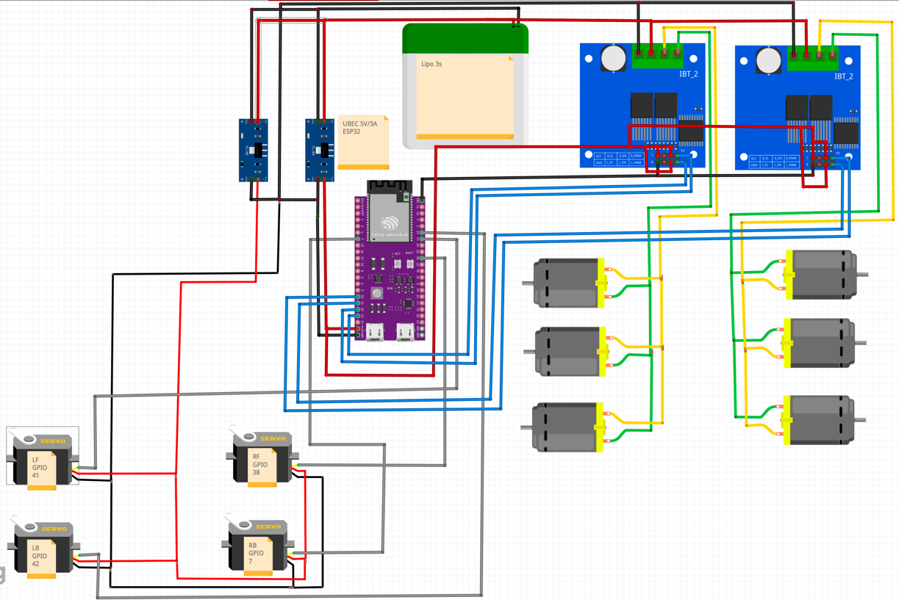

<!-- _class: lead -->

  <h1>Papaya Pathfinder: diseño y construcción de un rover 3D open-source</h1>
  
<strong>Sergio García Sánchez</strong>

  

---

## Índice

1. **Introducción**
2. **Inspiración: rovers de exploración**
3. **Ecosistema open-source**
4. **Objetivos de Papaya Pathfinder**
5. **Sistemas de control**
6. **Papaya Pathfinder Mini**
7. **Papaya Pathfinder**
8. **Futuros pasos**
---

## 1. Introducción

Papaya Pathfinder es un **rover terrestre impreso en 3D**, inspirado en los **rovers reales de exploración de Marte**.

Se plantea como una **plataforma open-source y reproducible** para integrar mecánica, electrónica, software y comunicaciones.

---

## 2. Inspiración: rovers de exploración

---

## 2. Inspiración: rocker-bogie

  

    El <strong>rocker-bogie</strong> es un sistema de suspensión pasiva diseñado para rovers de exploración planetaria.
    <ul>
        <li>Un <strong>brazo principal (rocker)</strong> por cada lado</li>
        <li>Un <strong>sub-brazo (bogie)</strong> que soporta las dos ruedas traseras</li>
        <li>Un <strong>diferencial mecánico</strong> que conecta ambos lados del rover</li>
    </ul>
    Este diseño permite que <strong>las seis ruedas mantengan contacto con el suelo</strong> incluso en terrenos muy irregulares.

  

  

---

## 3. Ecosistema open-source

<table class="table-compact">
  <thead>
    <tr>
      <th>Proyecto</th>
      <th>Suspensión</th>
      <th>Dirección</th>
      <th>Estructura</th>
    </tr>
  </thead>
  <tbody>
    <tr>
      <td>JPL Open Source Rover</td>
      <td>Rocker-bogie</td>
      <td>Delantera y trasera</td>
      <td>Aluminio mecanizado</td>
    </tr>
    <tr>
      <td>Sawppy</td>
      <td>Rocker-bogie</td>
      <td>Delantera y trasera</td>
      <td>Aluminio + piezas impresas en 3D</td>
    </tr>
    <tr>
      <td>ExoMy</td>
      <td>Triple-bogie articulado</td>
      <td>6WS (todas las ruedas)</td>
      <td>Impresión 3D</td>
    </tr>
  </tbody>
</table>

---

## 4. Objetivos de Papaya Pathfinder

- Diseñar un **rover 100 % imprimible en 3D**, reproducible y open-source
- Utilizar una **suspensión tipo rocker-bogie**
- Incorporar **dirección en las ruedas delanteras y traseras**
- Permitir **control remoto**:
    - **WiFi**, mediante una **aplicación Android** o **scripts en Python**, con soporte de **gamepad**
    - **Radio (ELRS)** para control a mayor distancia

---

## 5. Sistemas de control por WiFi

El control del rover se realiza mediante **WiFi**, lo que permite un desarrollo rápido y flexible.

- **Control mediante gamepad**
- Dos clientes disponibles:
    - **Script en Python**
    - **Aplicación Android**
- Ambos generan los **mismos comandos HTTP**
- El rover expone una **API sencilla** para recibir órdenes de movimiento

---

## 5. Sistemas de Control: ELRS

**ExpressLRS (ELRS)** es un sistema de radiocontrol de **código abierto**, diseñado para enlaces de **largo alcance** y **control en tiempo real**.

- Basado en tecnología **LoRa (Long Range)**
- Permite alcances **muy superiores al WiFi**, dependiendo de la configuración y el entorno
- Diseñado para **baja latencia** y alta tasa de refresco en control
- No requiere **infraestructura de red** (routers o puntos de acceso)

---

## 6. Papaya Pathfinder Mini: Diseño mecánico

---

## 6. Papaya Pathfinder Mini: Electrónica

---

## 7. Papaya Pathfinder: Diseño mecánico

---

## 7. Papaya Pathfinder: Electrónica

---

## 8. Futuros pasos

- Integrar **sensores adicionales**
- Añadir **cámaras**
- Construir una **representación simple del entorno**
- Diseñar un **brazo robótico**

---

  <h1>Preguntas</h1>
  
Papaya Pathfinder: rover 3D open-source inspirado en exploración planetaria

  
Sergio García Sánchez

  

    GitHub: <a href="https://github.com/tronxi/papaya-pathfinder">github.com/tronxi/papaya-pathfinder</a>
  

  
Gracias por su atención

